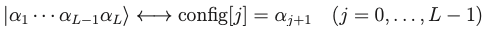
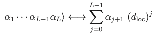
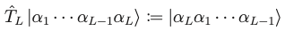

# HilbertSpace

## Coding convensions
- Naming convensions  

| | First letter | Word concatenation |
| :--- | :---: | ---: |
| Variable   | Lowercase | Camel case |
| Type alias | Uppercase | Camel case |
| Class      | Uppercase | Camel case |
| Method     | Lowercase | Snake case |
| Function   | Lowercase | Snake case |

## Coding conventions for mathematical objects

- Correspondence between Fock states and array objects  

- Correspondence between Fock states and integers  
  
where $d_{\mathrm{loc}} \coloneqq \dim \mathcal{H}_{\mathrm{loc}}$.

- Translation operator:  

