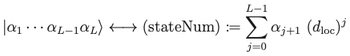

# HilbertSpace

## Coding conventions for mathematical objects

- Correspondence between Fock states and array objects  

- Correspondence between Fock states and integers
  
where $d_{\mathrm{loc}} \coloneqq \dim \mathcal{H}_{\mathrm{loc}}$.

- Translation operator:
TranslationOperator

